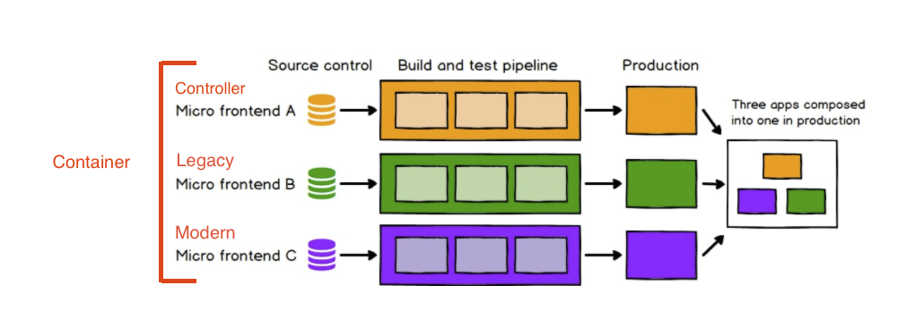

# microfrontend-poc
This project contains  proof of concept and some useful references of microfrontends.

# Introduction
Micro frontends are a new pattern where web application UIs (front ends) are composed from semi-independent fragments that can be built by different teams using different technologies. Micro-frontend architectures resemble back-end architectures where back ends are composed from semi-independent microservices.

# Architecture

# References
- https://github.com/billyjov/microfrontend-resources
- https://aws.amazon.com/blogs/architecture/micro-frontend-architectures-on-aws/
- https://www.cuelogic.com/blog/micro-frontends-frameworks
- https://betterprogramming.pub/the-future-of-micro-frontends-2f527f97d506
- https://levelup.gitconnected.com/micro-frontends-what-why-and-how-bf61f1f0a729
- https://www.n-ix.com/micro-frontends/
- https://dev.to/ruppysuppy/micro-frontends-the-next-gen-way-to-build-web-apps-16da
- https://www.sitepoint.com/a-beginners-guide-to-the-micro-front-end-architecture/
- https://medium.com/geekculture/how-to-create-a-micro-frontend-application-using-react-ef88c38b2fe6
